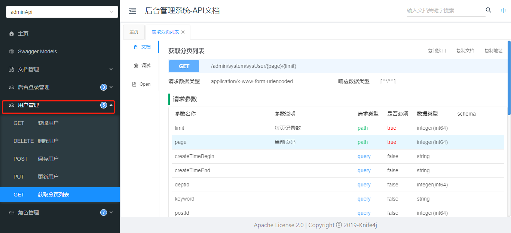

# 硅谷通用权限系统：用户管理

## 一、用户管理

### 1、用户管理CRUD

#### 1.1、mapper

```java
package com.atguigu.system.mapper;

import com.atguigu.model.system.SysUser;
import com.atguigu.vo.system.SysUserQueryVo;
import com.baomidou.mybatisplus.core.mapper.BaseMapper;
import com.baomidou.mybatisplus.core.metadata.IPage;
import com.baomidou.mybatisplus.extension.plugins.pagination.Page;
import org.apache.ibatis.annotations.Mapper;
import org.apache.ibatis.annotations.Param;

@Repository
@Mapper
public interface SysUserMapper extends BaseMapper<SysUser> {

    IPage<SysUser> selectPage(Page<SysUser> page, @Param("vo") SysUserQueryVo userQueryVo);

}
```

#### 1.2、xml

搜索条件暂时只加现有的，其他条件后续补充

```xml
<?xml version="1.0" encoding="UTF-8" ?>
        <!DOCTYPE mapper
                PUBLIC "-//mybatis.org//DTD Mapper 3.0//EN"
                "http://mybatis.org/dtd/mybatis-3-mapper.dtd">

<mapper namespace="com.atguigu.system.mapper.SysUserMapper">

    <resultMap id="SysUserMap" type="com.atguigu.model.system.SysUser" autoMapping="true">
    </resultMap>

    <!-- 用于select查询公用抽取的列 -->
    <sql id="columns">
      id,username,password,name,phone,head_url,post_id,dept_id,description,status,create_time,update_time,is_deleted
   </sql>

    <select id="selectPage" resultMap="SysUserMap">
        select <include refid="columns" />
        from sys_user
        <where>
            <if test="vo.keyword != null and vo.keyword != ''">
                and (username like CONCAT('%',#{vo.keyword},'%') or  name like CONCAT('%',#{vo.keyword},'%') or phone like CONCAT('%',#{vo.keyword},'%'))
            </if>
            <if test="vo.createTimeBegin != null and vo.createTimeBegin != ''">
                and create_time >= #{vo.createTimeBegin}
            </if>
            <if test="vo.createTimeEnd != null and vo.createTimeEnd != ''">
                and create_time &lt;= #{vo.createTimeEnd}
            </if>
            and is_deleted = 0
        </where>
        order by id desc
    </select>

</mapper>
```

#### 1.3、service接口

**SysUserService接口**

```java
package com.atguigu.system.service;


import com.atguigu.model.system.SysUser;
import com.atguigu.vo.system.SysUserQueryVo;
import com.baomidou.mybatisplus.core.metadata.IPage;
import com.baomidou.mybatisplus.extension.plugins.pagination.Page;
import com.baomidou.mybatisplus.extension.service.IService;

public interface SysUserService extends IService<SysUser> {

    IPage<SysUser> selectPage(Page<SysUser> pageParam, SysUserQueryVo adminQueryVo);

}
```

#### 1.4、service接口实现

**SysUserServiceImpl实现**

```java
package com.atguigu.system.service.impl;

import com.atguigu.model.system.SysUser;
import com.atguigu.system.mapper.SysUserMapper;
import com.atguigu.system.service.SysUserService;
import com.atguigu.vo.system.SysUserQueryVo;
import com.baomidou.mybatisplus.core.metadata.IPage;
import com.baomidou.mybatisplus.extension.plugins.pagination.Page;
import com.baomidou.mybatisplus.extension.service.impl.ServiceImpl;
import org.springframework.beans.factory.annotation.Autowired;
import org.springframework.stereotype.Service;

@Transactional
@Service
public class SysUserServiceImpl extends ServiceImpl<SysUserMapper, SysUser> implements SysUserService {

   @Autowired
   private SysUserMapper sysUserMapper;

   @Override
   public IPage<SysUser> selectPage(Page<SysUser> pageParam, SysUserQueryVo userQueryVo){

      return sysUserMapper.selectPage(pageParam, userQueryVo);
   }
}
```

#### 1.5、controller

```java
package com.atguigu.system.controller;

import com.atguigu.common.result.Result;
import com.atguigu.model.system.SysUser;
import com.atguigu.system.service.SysUserService;
import com.atguigu.vo.system.SysUserQueryVo;
import com.baomidou.mybatisplus.core.metadata.IPage;
import com.baomidou.mybatisplus.extension.plugins.pagination.Page;
import io.swagger.annotations.Api;
import io.swagger.annotations.ApiOperation;
import io.swagger.annotations.ApiParam;
import org.springframework.beans.factory.annotation.Autowired;
import org.springframework.web.bind.annotation.*;


@Api(tags = "用户管理")
@RestController
@RequestMapping("/admin/system/sysUser")
@CrossOrigin
public class SysUserController {

    @Autowired
    private SysUserService sysUserService;

    @ApiOperation(value = "获取分页列表")
    @GetMapping("/{page}/{limit}")
    public Result index(
            @ApiParam(name = "page", value = "当前页码", required = true)
            @PathVariable Long page,

            @ApiParam(name = "limit", value = "每页记录数", required = true)
            @PathVariable Long limit,

            @ApiParam(name = "userQueryVo", value = "查询对象", required = false)
                    SysUserQueryVo userQueryVo) {
        Page<SysUser> pageParam = new Page<>(page, limit);
        IPage<SysUser> pageModel = sysUserService.selectPage(pageParam, userQueryVo);
        return Result.ok(pageModel);
    }

    @ApiOperation(value = "获取用户")
    @GetMapping("/get/{id}")
    public Result get(@PathVariable Long id) {
        SysUser user = sysUserService.getById(id);
        return Result.ok(user);
    }

    @ApiOperation(value = "保存用户")
    @PostMapping("/save")
    public Result save(@RequestBody SysUser user) {
        sysUserService.save(user);
        return Result.ok();
    }

    @ApiOperation(value = "更新用户")
    @PutMapping("/update")
    public Result updateById(@RequestBody SysUser user) {
        sysUserService.updateById(user);
        return Result.ok();
    }

    @ApiOperation(value = "删除用户")
    @DeleteMapping("/remove/{id}")
    public Result remove(@PathVariable Long id) {
        sysUserService.removeById(id);
        return Result.ok();
    }

}
```

#### 1.6、knife4j测试

http://localhost:8800/doc.html



### 2、用户管理前端实现

#### 2.1、添加路由

**修改 src/router/index.js 文件**

```js
{
  path: '/system',
  component: Layout,
  meta: {
    title: '系统管理',
    icon: 'el-icon-s-tools'
  },
  alwaysShow: true,
  children: [
    {
      name: 'sysUser',
      path: 'sysUser',
      component: () => import('@/views/system/sysUser/list'),
      meta: {
        title: '用户管理',
        icon: 'el-icon-s-custom'
      },
    },
    {
      path: 'sysRole',
      component: () => import('@/views/system/sysRole/list'),
      meta: {
        title: '角色管理',
        icon: 'el-icon-user-solid'
      },
    }
  ]
},
```

#### 2.2、定义基础api

**创建文件 src/api/system/sysUser.js**

```js
import request from '@/utils/request'

const api_name = '/admin/system/sysUser'

export default {

  getPageList(page, limit, searchObj) {
    return request({
      url: `${api_name}/${page}/${limit}`,
      method: 'get',
      params: searchObj // url查询字符串或表单键值对
    })
  },
  getById(id) {
    return request({
      url: `${api_name}/get/${id}`,
      method: 'get'
    })
  },

  save(role) {
    return request({
      url: `${api_name}/save`,
      method: 'post',
      data: role
    })
  },

  updateById(role) {
    return request({
      url: `${api_name}/update`,
      method: 'put',
      data: role
    })
  },
  removeById(id) {
    return request({
      url: `${api_name}/remove/${id}`,
      method: 'delete'
    })
  }
}
```

#### 2.3、实现页面功能

**创建src/views/system/sysUser/list.vue**

```html
<template>
  <div class="app-container">

    <div class="search-div">
      <el-form label-width="70px" size="small">
        <el-row>
          <el-col :span="8">
            <el-form-item label="关 键 字">
              <el-input style="width: 95%" v-model="searchObj.keyword" placeholder="用户名/姓名/手机号码"></el-input>
            </el-form-item>
          </el-col>
          <el-col :span="8">
            <el-form-item label="操作时间">
              <el-date-picker
                v-model="createTimes"
                type="datetimerange"
                range-separator="至"
                start-placeholder="开始时间"
                end-placeholder="结束时间"
                value-format="yyyy-MM-dd HH:mm:ss"
                style="margin-right: 10px;width: 100%;"
              />
            </el-form-item>
          </el-col>
        </el-row>
        <el-row style="display:flex">
          <el-button type="primary" icon="el-icon-search" size="mini"  @click="fetchData()">搜索</el-button>
          <el-button icon="el-icon-refresh" size="mini" @click="resetData">重置</el-button>
        </el-row>
      </el-form>
    </div>

    <!-- 工具条 -->
    <div class="tools-div">
      <el-button type="success" icon="el-icon-plus" size="mini" @click="add">添 加</el-button>
    </div>

	<!-- 列表 -->
    <el-table
      v-loading="listLoading"
      :data="list"
      stripe
      border
      style="width: 100%;margin-top: 10px;">

      <el-table-column
        label="序号"
        width="70"
        align="center">
        <template slot-scope="scope">
          {{ (page - 1) * limit + scope.$index + 1 }}
        </template>
      </el-table-column>

      <el-table-column prop="username" label="用户名" width="180"/>
      <el-table-column prop="name" label="姓名" width="110"/>
      <el-table-column prop="phone" label="手机" />
      <el-table-column label="状态" width="80">
        <template slot-scope="scope">
          <el-switch
            v-model="scope.row.status === 1"
            @change="switchStatus(scope.row)">
          </el-switch>
        </template>
      </el-table-column>
      <el-table-column prop="createTime" label="创建时间" />

      <el-table-column label="操作"  align="center" fixed="right">
        <template slot-scope="scope">
          <el-button type="primary" icon="el-icon-edit" size="mini" @click="edit(scope.row.id)" title="修改"/>
          <el-button type="danger" icon="el-icon-delete" size="mini" @click="removeDataById(scope.row.id)" title="删除" />
        </template>
      </el-table-column>
    </el-table>

    <!-- 分页组件 -->
    <el-pagination
      :current-page="page"
      :total="total"
      :page-size="limit"
      style="padding: 30px 0; text-align: center;"
      layout="total, prev, pager, next, jumper"
      @current-change="fetchData"
    />

    <el-dialog title="添加/修改" :visible.sync="dialogVisible" width="40%" >
      <el-form ref="dataForm" :model="sysUser"  label-width="100px" size="small" style="padding-right: 40px;">
        <el-form-item label="用户名" prop="username">
          <el-input v-model="sysUser.username"/>
        </el-form-item>
        <el-form-item v-if="!sysUser.id" label="密码" prop="password">
          <el-input v-model="sysUser.password" type="password"/>
        </el-form-item>
        <el-form-item label="姓名" prop="name">
          <el-input v-model="sysUser.name"/>
        </el-form-item>
        <el-form-item label="手机" prop="phone">
          <el-input v-model="sysUser.phone"/>
        </el-form-item>
      </el-form>
      <span slot="footer" class="dialog-footer">
        <el-button @click="dialogVisible = false" size="small" icon="el-icon-refresh-right">取 消</el-button>
        <el-button type="primary" icon="el-icon-check" @click="saveOrUpdate()" size="small">确 定</el-button>
      </span>
    </el-dialog>
  </div>
</template>

<script>
import api from '@/api/system/sysUser'
const defaultForm = {
  id: '',
  username: '',
  password: '',
  name: '',
  phone: '',
  status: 1
}
export default {
  data() {
    return {
      listLoading: true, // 数据是否正在加载
      list: null, // banner列表
      total: 0, // 数据库中的总记录数
      page: 1, // 默认页码
      limit: 10, // 每页记录数
      searchObj: {}, // 查询表单对象

      createTimes: [],

      dialogVisible: false,
      sysUser: defaultForm,
      saveBtnDisabled: false,
    }
  },

  // 生命周期函数：内存准备完毕，页面尚未渲染
  created() {
    console.log('list created......')
    this.fetchData()
  },

  // 生命周期函数：内存准备完毕，页面渲染成功
  mounted() {
    console.log('list mounted......')
  },

  methods: {
    // 加载banner列表数据
    fetchData(page = 1) {
      debugger
      this.page = page
      if(this.createTimes && this.createTimes.length ==2) {
        this.searchObj.createTimeBegin = this.createTimes[0]
        this.searchObj.createTimeEnd = this.createTimes[1]
      }

      api.getPageList(this.page, this.limit, this.searchObj).then(
        response => {
          //this.list = response.data.list
          this.list = response.data.records
          this.total = response.data.total

          // 数据加载并绑定成功
          this.listLoading = false
        }
      )
    },

    // 重置查询表单
    resetData() {
      console.log('重置查询表单')
      this.searchObj = {}
      this.createTimes = []
      this.fetchData()
    },

    // 根据id删除数据
    removeDataById(id) {
      // debugger
      this.$confirm('此操作将永久删除该记录, 是否继续?', '提示', {
        confirmButtonText: '确定',
        cancelButtonText: '取消',
        type: 'warning'
      }).then(() => { // promise
        // 点击确定，远程调用ajax
        return api.removeById(id)
      }).then((response) => {
        this.fetchData(this.page)
        this.$message.success(response.message || '删除成功')
      }).catch(() => {
         this.$message.info('取消删除')
      })
    },

    //弹出添加表单
    add(){
      this.dialogVisible = true
      this.sysUser = {}
    },
	//编辑
    edit(id) {
      this.dialogVisible = true
      api.getById(id).then(response => {
        this.sysUser = response.data
      })
    },
    
    //添加或更新
    saveOrUpdate() {
        if (!this.sysUser.id) {
            this.save()
        } else {
            this.update()
        }
    },

    //添加
    save() {
      api.save(this.sysUser).then(response => {
        this.$message.success('操作成功')
        this.dialogVisible = false
        this.fetchData(this.page)
      })
    },

    //更新
    update() {
      api.updateById(this.sysUser).then(response => {
        this.$message.success(response.message || '操作成功')
        this.dialogVisible = false
        this.fetchData(this.page)
      })
    }
  }
}
</script>
```

### 3、更改用户状态

#### 3.1、需求分析

用户状态：状态（1：正常 0：停用），当用户状态为正常时，可以访问后台系统，当用户状态停用后，不可以登录后台系统

#### 3.2、controller方法

操作类：SysUserController

```java
@ApiOperation(value = "更新状态")
@GetMapping("updateStatus/{id}/{status}")
public Result updateStatus(@PathVariable Long id, @PathVariable Integer status) {
    sysUserService.updateStatus(id, status);
    return Result.ok();
}
```

#### 3.3、service接口

操作类：SysUserService

```java
void updateStatus(Long id, Integer status);
```

#### 3.4、service接口实现

操作类：SysUserServiceImpl

```java
@Override
public void updateStatus(Long id, Integer status) {
    SysUser sysUser = sysUserMapper.selectById(id);
    sysUser.setStatus(status);
    sysUserMapper.updateById(sysUser);
}
```

### 4、前端实现

#### 4.1、添加api

**src/api/system/sysUser.js**

```js
//更新用户状态
updateStatus(id, status) {
  return request({
    url: `${api_name}/updateStatus/${id}/${status}`,
    method: 'get'
  })
}
```

#### 4.2、修改页面

**更改src/views/system/sysUser/list.vue**

```js
//切换用户状态
switchStatus(row) {
    row.status = row.status === 1 ? 0 : 1
    api.updateStatus(row.id, row.status).then(response => {
        if (response.code) {
            this.$message.success(response.message || '操作成功')
            this.fetchData()
        }
    })
}
```


## 二、给用户分配角色

### 1、给用户分配角色

#### 1.1、接口分析

1、进入分配页面：获取已分配角色与全部角色，进行页面展示

2、保存分配角色：删除之前分配的角色和保存现在分配的角色

#### 1.2、controller方法

操作类：SysRoleController

```java
@ApiOperation(value = "根据用户获取角色数据")
@GetMapping("/toAssign/{userId}")
public Result toAssign(@PathVariable Long userId) {
    Map<String, Object> roleMap = sysRoleService.getRolesByUserId(userId);
    return Result.ok(roleMap);
}

@ApiOperation(value = "根据用户分配角色")
@PostMapping("/doAssign")
public Result doAssign(@RequestBody AssginRoleVo assginRoleVo) {
    sysRoleService.doAssign(assginRoleVo);
    return Result.ok();
}
```

#### 1.3、service接口

操作类：SysRoleService

```java
/**
 * 根据用户获取角色数据
 * @param userId
 * @return
 */
Map<String, Object> getRolesByUserId(Long userId);

/**
 * 分配角色
 * @param assginRoleVo
 */
void doAssign(AssginRoleVo assginRoleVo);
```

#### 1.4、service接口实现

操作类：SysRoleServiceImpl

```java
@Autowired
private SysUserRoleMapper sysUserRoleMapper;

 @Override
    public Map<String, Object> getRolesByUserId(Long userId) {
        //获取所有角色
        List<SysRole> roles = sysRoleMapper.selectList(null);
        //根据用户id查询
        QueryWrapper<SysUserRole> queryWrapper = new QueryWrapper<>();
        queryWrapper.eq("user_id",userId);
        //获取用户已分配的角色
        List<SysUserRole> userRoles = sysUserRoleMapper.selectList(queryWrapper);
        //获取用户已分配的角色id
        List<Long> userRoleIds = new ArrayList<>();
        for (SysUserRole userRole : userRoles) {
            userRoleIds.add(userRole.getRoleId());
        }
        //创建返回的Map
        Map<String, Object> returnMap = new HashMap<>();
        returnMap.put("allRoles",roles);
        returnMap.put("userRoleIds",userRoleIds);
        return returnMap;
    }

    @Override
    public void doAssign(AssginRoleVo assginRoleVo) {
        //根据用户id删除原来分配的角色
        QueryWrapper<SysUserRole> queryWrapper = new QueryWrapper<>();
        queryWrapper.eq("user_id",assginRoleVo.getUserId());
        sysUserRoleMapper.delete(queryWrapper);
        //获取所有的角色id
        List<Long> roleIdList = assginRoleVo.getRoleIdList();
        for (Long roleId : roleIdList) {
            if(roleId != null){
                SysUserRole sysUserRole = new SysUserRole();
                sysUserRole.setUserId(assginRoleVo.getUserId());
                sysUserRole.setRoleId(roleId);
                //保存
                sysUserRoleMapper.insert(sysUserRole);
            }
        }
    }
```

#### 1.5、添加SysUserRoleMapper类

```java
package com.atguigu.system.mapper;

import com.atguigu.model.system.SysUserRole;
import com.baomidou.mybatisplus.core.mapper.BaseMapper;
import org.apache.ibatis.annotations.Mapper;
import org.springframework.stereotype.Repository;

@Repository
@Mapper
public interface SysUserRoleMapper extends BaseMapper<SysUserRole> {

}
```


### 2、前端实现

#### 2.1、添加api

**src/api/system/sysRole.js**

```js
//根据用户id查询用户已分配的角色
getRolesByUserId(userId) {
  return request({
    url: `${api_name}/toAssign/${userId}`,
    method: 'get'
  })
},

//分配角色
assignRoles(assginRoleVo) {
  return request({
    url: `${api_name}/doAssign`,
    method: 'post',
    data: assginRoleVo
  })
}
```

#### 2.2、修改页面

**更改src/views/system/sysUser/list.vue**

添加分配角色按钮

```html
 <el-button type="warning" icon="el-icon-baseball" size="mini" @click="showAssignRole(scope.row)" title="分配角色"/>
```

添加分配角色表单

```html
    <el-dialog title="分配角色" :visible.sync="dialogRoleVisible">
      <el-form label-width="80px">
        <el-form-item label="用户名">
          <el-input disabled :value="sysUser.username"></el-input>
        </el-form-item>

        <el-form-item label="角色列表">
          <el-checkbox :indeterminate="isIndeterminate" v-model="checkAll" @change="handleCheckAllChange">全选</el-checkbox>
          <div style="margin: 15px 0;"></div>
          <el-checkbox-group v-model="userRoleIds" @change="handleCheckedChange">
            <el-checkbox v-for="role in allRoles" :key="role.id" :label="role.id">{{role.roleName}}</el-checkbox>
          </el-checkbox-group>
        </el-form-item>
      </el-form>
      <div slot="footer">
        <el-button type="primary" @click="assignRole" size="small">保存</el-button>
        <el-button @click="dialogRoleVisible = false" size="small">取消</el-button>
      </div>
    </el-dialog>
```

添加方法

```html
<script>
import api from '@/api/system/sysUser'
import roleApi from '@/api/system/sysRole'
const defaultForm = {
  id: '',
  username: '',
  password: '',
  name: '',
  phone: '',
  status: 1
}
export default {
  data() {
    return {
      listLoading: true, // 数据是否正在加载
      list: null, // banner列表
      total: 0, // 数据库中的总记录数
      page: 1, // 默认页码
      limit: 10, // 每页记录数
      searchObj: {}, // 查询表单对象

      createTimes: [],

      dialogVisible: false,
      sysUser: defaultForm,
      saveBtnDisabled: false,

      dialogRoleVisible: false,
      allRoles: [], // 所有角色列表
      userRoleIds: [], // 用户的角色ID的列表
      isIndeterminate: false, // 是否是不确定的
      checkAll: false // 是否全选
    }
  },

  // 生命周期函数：内存准备完毕，页面尚未渲染
  created() {
    console.log('list created......')
    this.fetchData()
  },

  // 生命周期函数：内存准备完毕，页面渲染成功
  mounted() {
    console.log('list mounted......')
  },

  methods: {
	//添加以下方法

    //展示分配角色
    showAssignRole (row) {
      this.sysUser = row
      this.dialogRoleVisible = true
       roleApi.getRolesByUserId(row.id).then(response => {
        this.allRoles = response.data.allRoles
        this.userRoleIds = response.data.userRoleIds
        this.checkAll = this.userRoleIds.length===this.allRoles.length
        this.isIndeterminate = this.userRoleIds.length>0 && this.userRoleIds.length<this.allRoles.length
      })
    },

    /*
    全选勾选状态发生改变的监听
    */
    handleCheckAllChange (value) {// value 当前勾选状态true/false
      // 如果当前全选, userRoleIds就是所有角色id的数组, 否则是空数组
      this.userRoleIds = value ? this.allRoles.map(item => item.id) : []
      // 如果当前不是全选也不全不选时, 指定为false
      this.isIndeterminate = false
    },

    /*
    角色列表选中项发生改变的监听
    */
    handleCheckedChange (value) {
      const {userRoleIds, allRoles} = this
      this.checkAll = userRoleIds.length === allRoles.length && allRoles.length>0
      this.isIndeterminate = userRoleIds.length>0 && userRoleIds.length<allRoles.length
    },

    //分配角色
    assignRole () {
      let assginRoleVo = {
        userId: this.sysUser.id,
        roleIdList: this.userRoleIds
      }
      roleApi.assignRoles(assginRoleVo).then(response => {
        this.$message.success(response.message || '分配角色成功')
        this.dialogRoleVisible = false
        this.fetchData(this.page)
      })
    },
    
  }
}
</script>
```
